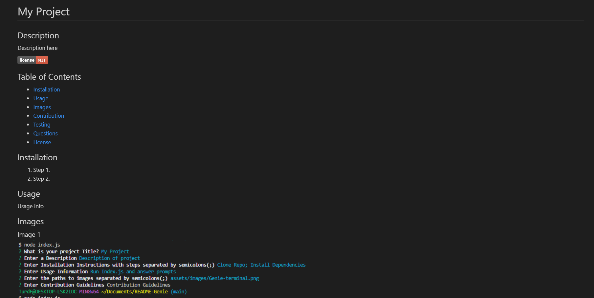
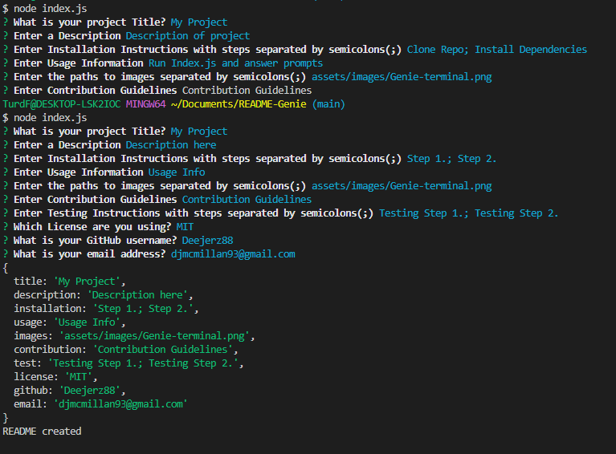

# README GENIE
## Description
Generage a Profession README file for your project!
## Table of Contents
- [Installation](#installation)
- [Usage](#usage)
- [Images](#images)
- [Questions](#questions)

## Installation
1. Clone repo.
2. Run npm i

## Usage
To use this appliction, simply run "node index.js" and answer the prompts. You can then copy the README-generated.md file to your project and rename it to README.md

## Images
Image 1

Image 2

## Questions
[My GitHub Profile](https://github.com/Deejerz88)

If you have any questions about my project, please contact me at [djmcmillan93@gmail.com](mailto:djmcmillan93@gmail.com).
